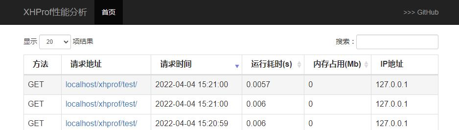

# Xhprof


## 概述

「Xhprof」是为了在生产环境中使用而打造的。它对性能的影响最小，同时收集足够的信息用于诊断性能问题。


## 运行环境
- PHP 7.0+
- xhprof extension
- redis extension

## 安装方法

通过composer管理您的项目依赖，可以在你的项目根目录运行：

    $ composer require phpxxb/xhprof


## 快速使用

### 常用方法

| 方法名 | 解释 |
|:------------------|:------------------------------------|
|Xhprof\Xhprof\index() | 页面输出方法，用于展示xhprof搜集到的运行信息 |
|Xhprof\Xhprof\xhprofStart() | 开启监听方法，用于处理数据的收集、存储、加工等 |


### 使用示例(laravel框架/TP5框架)
1.php安装`redis`、`xhprof`扩展
2.执行`composer require phpxxb/xhprof`下载依赖的库
3.拷贝所需样式文件到「公共目录」
```
cp -r ./vendor/phpxxb/xhprof/src/xhprof/xhprof_html  ./public
```
4.代码层，Xhprof开启监听，可放基础控制器中
```
public function __construct()
{
    $config = [
        'ui_dir_url_path' => '/xhprof_html'
    ];
    $xhprof = new \Xhprof\Xhprof($config);
    $xhprof->xhprofStart();
}
```
5.定义路由，展示结果页面
```
Route::get("xhprof", function (){
    $config = [
        'ui_dir_url_path' => '/xhprof_html'
    ];
    $xhprof = new \Xhprof\Xhprof($config);
    $xhprof->index();
});
```
6.浏览器打开地址看效果




### 配置参考

    ui_dir_url_path     xhprof_html目录的路径，需配合cp命令
    redis_host          redis主机(默认：localhost)
    redis_port          redis端口(默认：6379)
    redis_pwd           redis端口(默认为空)
    redis_db            redis数据库(默认：0)
    key_prefix          redis存储数据的前缀(默认：xhprof)
    time_limit          请求超过多少秒开始记录(默认：0，记录所有)
    log_num             保留最近的多少条记录(默认：1000，保留1000条记录)
    view_wtred          列表页面超过多少秒标红(默认：3，请求耗时超过3秒标红)
    ignore_url_arr      需忽略不作为统计的请求。


## License

- MIT


## 联系我们

邮箱：phpxxb@163.com
